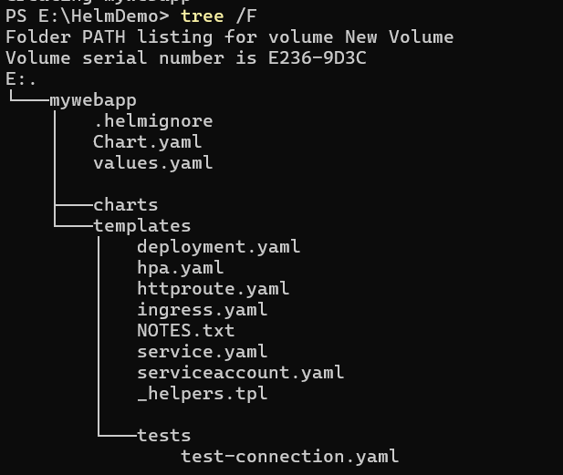
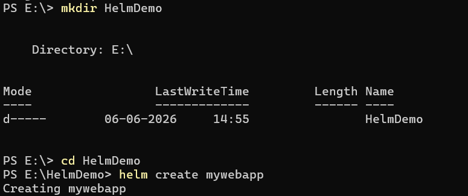
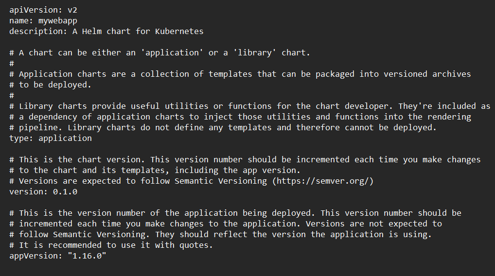
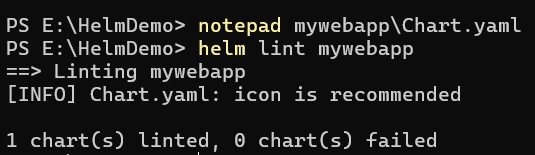
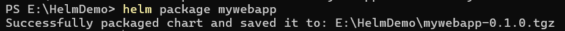
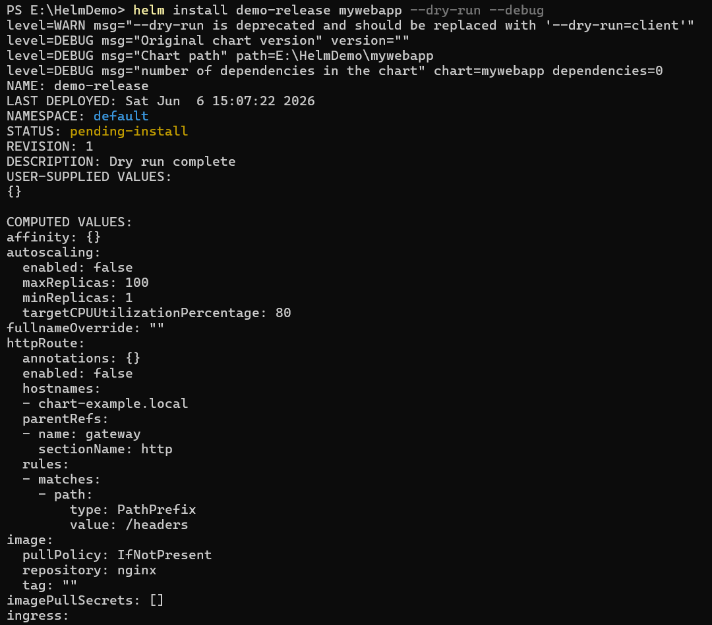
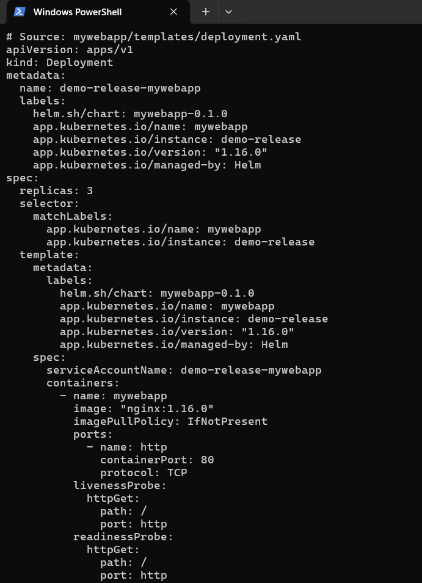
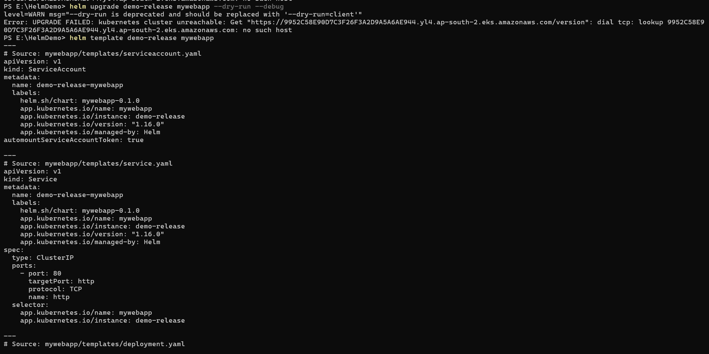
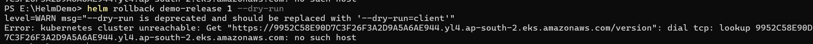

# Helm Chart Simulation Using Helm Template and Dry Run

## Overview

This project demonstrates the usage of Helm for packaging, rendering, and managing Kubernetes application deployments without requiring a live Kubernetes cluster. Helm commands such as `create`, `lint`, `template`, `package`, and `dry-run` were used to simulate deployment workflows and understand Helm chart operations.

---

## Objectives

- Create a sample Helm chart.
- Understand Helm chart structure and components.
- Validate Helm charts using Helm lint.
- Render Kubernetes manifests locally.
- Package Helm charts for distribution.
- Simulate installation and upgrade operations.
- Demonstrate rollback command usage and limitations without a Kubernetes cluster.

---

## Prerequisites

- Windows 10/11
- Helm 3.x
- PowerShell
- Visual Studio Code (Optional)

---

# Project Structure

```text
HELMDEMO
│
├── mywebapp
│   ├── charts
│   ├── templates
│   │   ├── tests
│   │   │   └── test-connection.yaml
│   │   ├── _helpers.tpl
│   │   ├── deployment.yaml
│   │   ├── hpa.yaml
│   │   ├── httproute.yaml
│   │   ├── ingress.yaml
│   │   ├── NOTES.txt
│   │   ├── service.yaml
│   │   └── serviceaccount.yaml
│   ├── .helmignore
│   ├── Chart.yaml
│   └── values.yaml
│
├── screenshots
│   ├── Chart-creation.png
│   ├── Chart.yaml.png
│   ├── Folder-structure.png
│   ├── Helm-version-output.png
│   ├── Package-the-Chart.png
│   ├── RenderAgain.png
│   ├── Rollback-Demonstration.png
│   ├── Simulate-Installation.png
│   ├── Simulate-Upgrade.png
│   └── Validate-Chart.png
│
├── mywebapp-0.1.0.tgz
├── rendered.yaml
└── README.md
```

### Folder Structure Screenshot



---

# Step 1: Verify Helm Installation

Verify that Helm is installed successfully.

```powershell
helm version
```

### Output


---

# Step 2: Create a Sample Helm Chart

Create a new Helm chart named `mywebapp`.

```powershell
helm create mywebapp
```

### Output



---

# Step 3: Review Chart Metadata

Open the `Chart.yaml` file to review chart metadata.

```powershell
notepad mywebapp\Chart.yaml
```

### Chart.yaml Screenshot



---

# Step 4: Validate the Helm Chart

Validate the chart syntax and structure.

```powershell
helm lint mywebapp
```

### Output



---

# Step 5: Render Kubernetes Manifests

Render Kubernetes manifests locally without requiring a Kubernetes cluster.

```powershell
helm template demo-release mywebapp
```

Save output to a file:

```powershell
helm template demo-release mywebapp > rendered.yaml
```

Generated file:

```text
rendered.yaml
```

---

# Step 6: Package the Helm Chart

Package the chart into a distributable archive.

```powershell
helm package mywebapp
```

### Output



Generated package:

```text
mywebapp-0.1.0.tgz
```

---

# Step 7: Simulate Installation

Use Helm dry-run mode to simulate installation.

```powershell
helm install demo-release mywebapp --dry-run --debug
```

### Output



### Purpose

- Validates chart deployment.
- Displays rendered manifests.
- Does not create any Kubernetes resources.

---

# Step 8: Modify Values and Render Again

Edit `values.yaml` and change:

```yaml
replicaCount: 1
```

to:

```yaml
replicaCount: 3
```

Render the chart again:

```powershell
helm template demo-release mywebapp
```

### Output



### Verification

The deployment manifest now contains:

```yaml
replicas: 3
```

---

# Step 9: Simulate Upgrade

Simulate an upgrade operation using dry-run mode.

```powershell
helm upgrade demo-release mywebapp --dry-run --debug
```

### Output



### Purpose

- Simulates release upgrades.
- Displays updated manifests.
- No changes are applied to a cluster.

---

# Step 10: Rollback Demonstration

Attempt a rollback operation.

```powershell
helm rollback demo-release 1 --dry-run
```

### Output



### Explanation

Helm rollback requires release history stored inside a Kubernetes cluster. Since this project was executed without a Kubernetes cluster, the rollback operation could not be completed. The command was demonstrated for documentation purposes.

---

# Generated Files

## Rendered Kubernetes Manifest

```text
rendered.yaml
```

Contains all Kubernetes manifests generated by:

```powershell
helm template demo-release mywebapp > rendered.yaml
```

## Packaged Helm Chart

```text
mywebapp-0.1.0.tgz
```

Created using:

```powershell
helm package mywebapp
```

---

# Deliverables

- Helm Source Chart (`mywebapp`)
- Packaged Helm Chart (`mywebapp-0.1.0.tgz`)
- Rendered Manifest (`rendered.yaml`)
- Screenshots
- README Documentation

---

# Conclusion

This project successfully demonstrates Helm chart creation, validation, manifest rendering, packaging, installation simulation, and upgrade simulation without requiring a Kubernetes cluster. Helm's template and dry-run capabilities provide an effective method for learning and validating Helm workflows in a local development environment.